# Get data from movebank


```
## [1] TRUE
```


Date of the previous data update: 2021-05-10 19:41:33 (20 day(s))


To import data of Kivi-Kuaka program from movebank website we use function from the move library. 
The id of the program in the movebank database is _1381110575_.


# Summary of update

## The birds


In French Polynesia, we deployed Icarus GPS 5g beacon on 56 birds of four species, three shorebirds (13 Bristle-thighed Curlew, 8 Pacific Golden Plover, 23 Wandering Tattler), and 12 Sooty Tern. 


<table class="table table-hover" style="font-size: 11px; width: auto !important; margin-left: auto; margin-right: auto;">
<caption style="font-size: initial !important;">The summary of number of birds</caption>
 <thead>
  <tr>
   <th style="text-align:left;position: sticky; top:0; background-color: #FFFFFF;"> taxon_eng </th>
   <th style="text-align:left;position: sticky; top:0; background-color: #FFFFFF;"> taxon_fr </th>
   <th style="text-align:right;position: sticky; top:0; background-color: #FFFFFF;"> nb_birds </th>
   <th style="text-align:right;position: sticky; top:0; background-color: #FFFFFF;"> nb_birds_5days </th>
   <th style="text-align:right;position: sticky; top:0; background-color: #FFFFFF;"> prop_5days </th>
   <th style="text-align:right;position: sticky; top:0; background-color: #FFFFFF;"> nb_birds_15days </th>
   <th style="text-align:right;position: sticky; top:0; background-color: #FFFFFF;"> prop_15days </th>
   <th style="text-align:right;position: sticky; top:0; background-color: #FFFFFF;"> nb_birds_30days </th>
   <th style="text-align:right;position: sticky; top:0; background-color: #FFFFFF;"> prop_30days </th>
  </tr>
 </thead>
<tbody>
  <tr>
   <td style="text-align:left;"> Bristle-thighed curlew </td>
   <td style="text-align:left;"> Courlis d'Alaska </td>
   <td style="text-align:right;"> 11 </td>
   <td style="text-align:right;"> 8 </td>
   <td style="text-align:right;"> 0.73 </td>
   <td style="text-align:right;"> 9 </td>
   <td style="text-align:right;"> 0.82 </td>
   <td style="text-align:right;"> 9 </td>
   <td style="text-align:right;"> 0.82 </td>
  </tr>
  <tr>
   <td style="text-align:left;"> Sooty tern </td>
   <td style="text-align:left;"> Sterne fuligineuse </td>
   <td style="text-align:right;"> 7 </td>
   <td style="text-align:right;"> 0 </td>
   <td style="text-align:right;"> 0.00 </td>
   <td style="text-align:right;"> 0 </td>
   <td style="text-align:right;"> 0.00 </td>
   <td style="text-align:right;"> 2 </td>
   <td style="text-align:right;"> 0.29 </td>
  </tr>
  <tr>
   <td style="text-align:left;"> Pacific golden plover </td>
   <td style="text-align:left;"> Pluvier fauve </td>
   <td style="text-align:right;"> 8 </td>
   <td style="text-align:right;"> 1 </td>
   <td style="text-align:right;"> 0.12 </td>
   <td style="text-align:right;"> 1 </td>
   <td style="text-align:right;"> 0.12 </td>
   <td style="text-align:right;"> 1 </td>
   <td style="text-align:right;"> 0.12 </td>
  </tr>
  <tr>
   <td style="text-align:left;"> Wandering tattler </td>
   <td style="text-align:left;"> Chevalier errant </td>
   <td style="text-align:right;"> 21 </td>
   <td style="text-align:right;"> 8 </td>
   <td style="text-align:right;"> 0.38 </td>
   <td style="text-align:right;"> 12 </td>
   <td style="text-align:right;"> 0.57 </td>
   <td style="text-align:right;"> 14 </td>
   <td style="text-align:right;"> 0.67 </td>
  </tr>
</tbody>
</table>


Among these 56 birds, __47__ birds with Icarus GPS beacons sent to at least one location. In the last fifteen days, __22__ beacons (47%) sent data, this number pass to __0__ beacons (0%) in the last ten days, and for the last five days, __17__ beacons (36%).


<div class="figure" style="text-align: center">

<p class="caption">Distrubiton of the number of days before after location by species</p>
</div>


## The new events


In the events database, there are 7260 data, but some do not have a valid location. 
There are __4376__ data with location, that corresponds to 60\%.


There are __826__ new data since the last update 2021-05-10 19:41:33 (20 day(s)). 


## The events by day


<div class="figure" style="text-align: center">
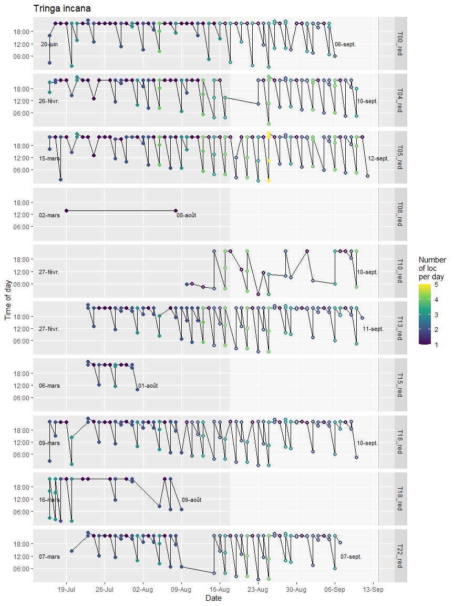
<p class="caption">The bird locations by day for the Wandering tattler during the last 60 days</p>
</div><div class="figure" style="text-align: center">
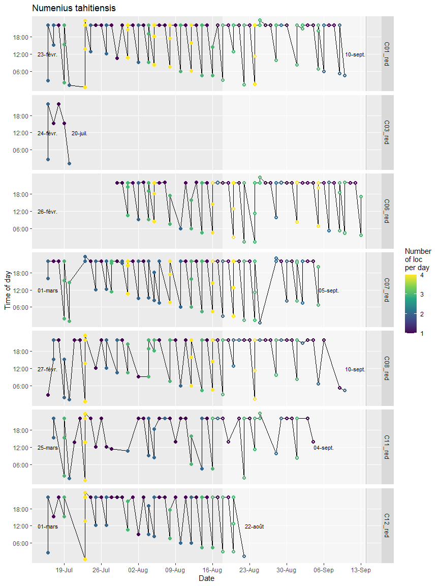
<p class="caption">The bird locations by day for the Bristle-thighed curlew during the last 60 days</p>
</div><div class="figure" style="text-align: center">
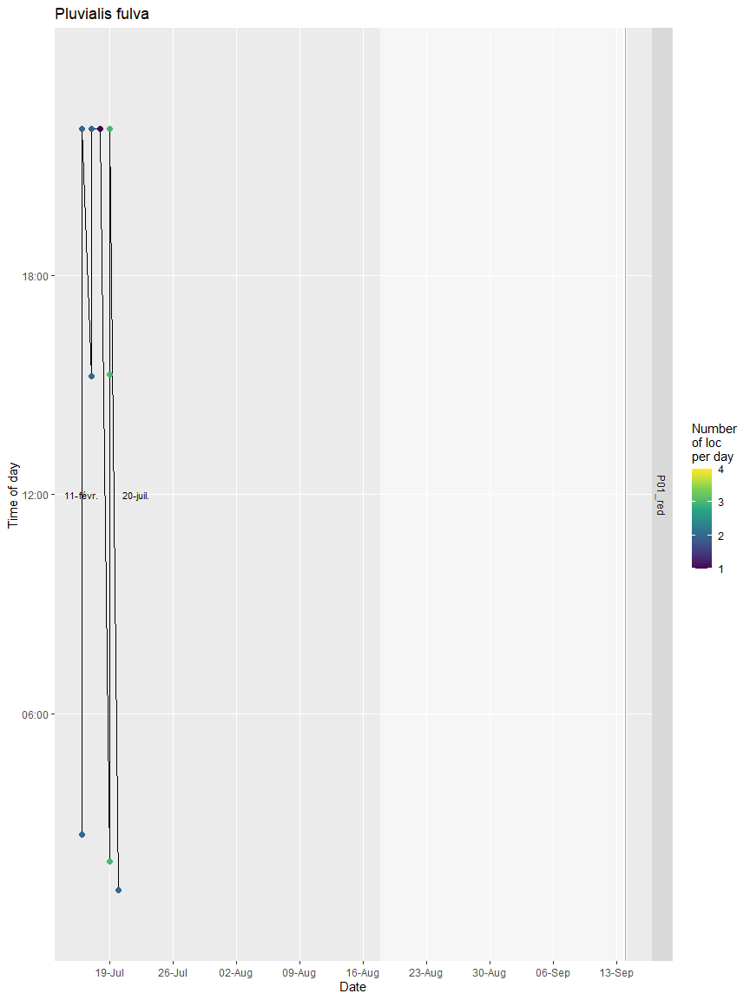
<p class="caption">The bird locations by day for the Pacific golden plover during the last 60 days</p>
</div><div class="figure" style="text-align: center">

<p class="caption">The bird locations by day for the Sooty tern during the last 60 days</p>
</div>

# The recent moves


```
## figure c:/GIT/kivikuaka/output/map_new_C01_red.png
```

```
## figure c:/GIT/kivikuaka/output/map_new_C03_red.png
```

<div class="figure" style="text-align: center">
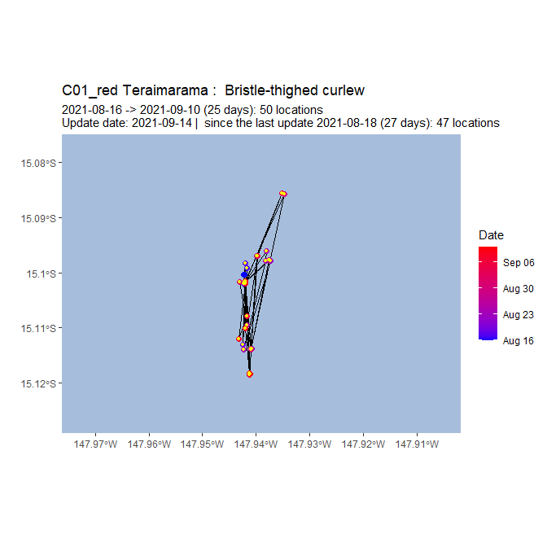
<p class="caption">The last ten days moves of the Bristle-thighed curlew C01_red named Teraimarama. Yellow dots for the new locations</p>
</div>

```
## figure c:/GIT/kivikuaka/output/map_new_C04_red.png
```

<div class="figure" style="text-align: center">
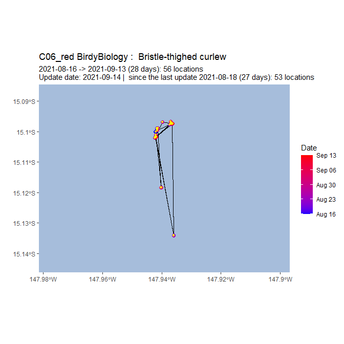
<p class="caption">The last ten days moves of the Bristle-thighed curlew C03_red named Manurere. Yellow dots for the new locations</p>
</div>

```
## figure c:/GIT/kivikuaka/output/map_new_C05_red.png
```

<div class="figure" style="text-align: center">

<p class="caption">The last ten days moves of the Bristle-thighed curlew C04_red. Yellow dots for the new locations</p>
</div>

```
## figure c:/GIT/kivikuaka/output/map_new_C06_red.png
```

<div class="figure" style="text-align: center">

<p class="caption">The last ten days moves of the Bristle-thighed curlew C05_red named Heirua. Yellow dots for the new locations</p>
</div>

```
## figure c:/GIT/kivikuaka/output/map_new_C07_red.png
```

<div class="figure" style="text-align: center">

<p class="caption">The last ten days moves of the Bristle-thighed curlew C06_red. Yellow dots for the new locations</p>
</div>

```
## figure c:/GIT/kivikuaka/output/map_new_C08_red.png
```

<div class="figure" style="text-align: center">
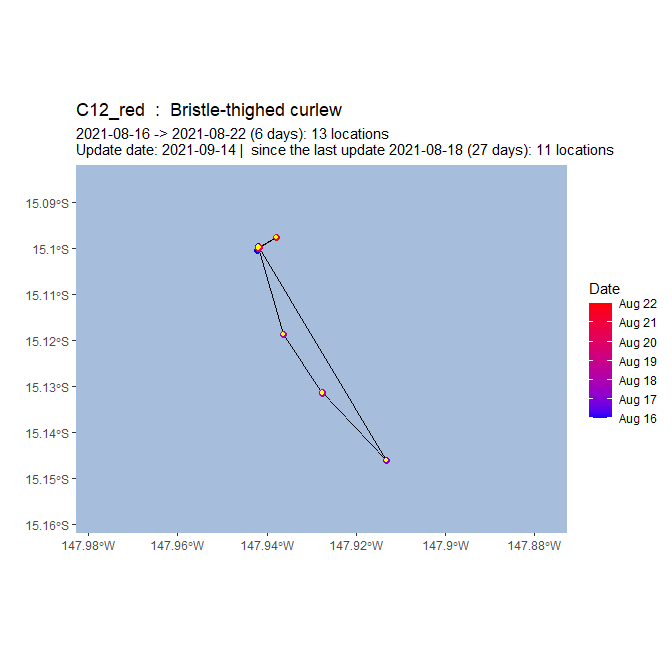
<p class="caption">The last ten days moves of the Bristle-thighed curlew C07_red. Yellow dots for the new locations</p>
</div>

```
## figure c:/GIT/kivikuaka/output/map_new_C11_red.png
```

<div class="figure" style="text-align: center">
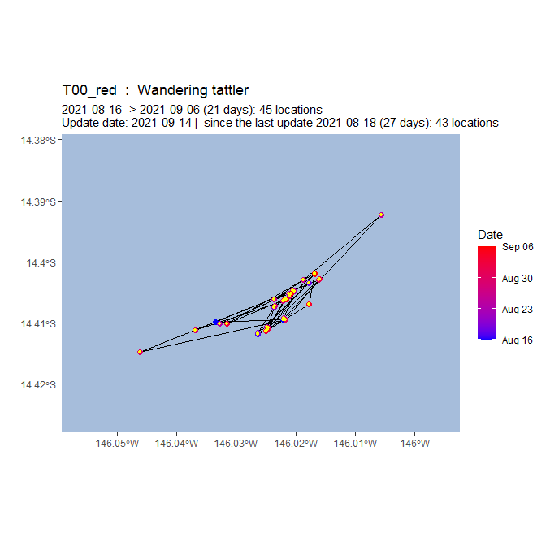
<p class="caption">The last ten days moves of the Bristle-thighed curlew C08_red. Yellow dots for the new locations</p>
</div>

```
## figure c:/GIT/kivikuaka/output/map_new_C12_red.png
```

<div class="figure" style="text-align: center">
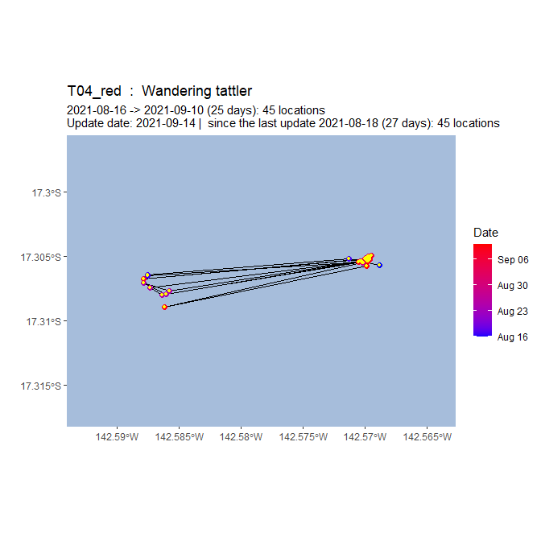
<p class="caption">The last ten days moves of the Bristle-thighed curlew C11_red. Yellow dots for the new locations</p>
</div>

```
## figure c:/GIT/kivikuaka/output/map_new_P01_red.png
```

<div class="figure" style="text-align: center">
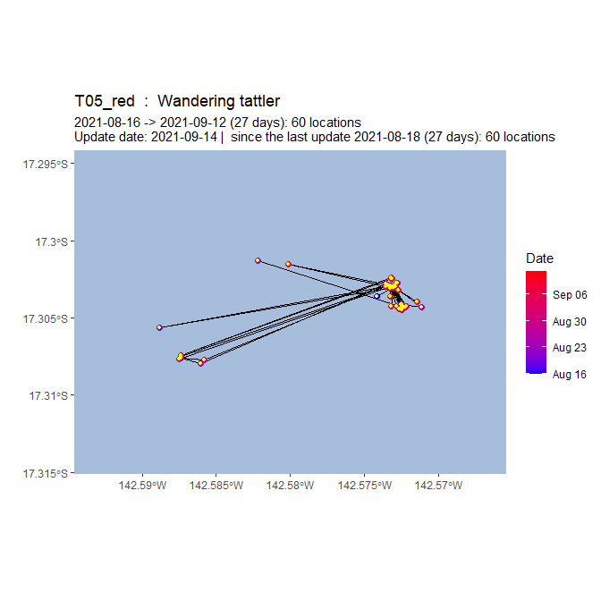
<p class="caption">The last ten days moves of the Bristle-thighed curlew C12_red. Yellow dots for the new locations</p>
</div>

```
## figure c:/GIT/kivikuaka/output/map_new_S08_red.png
```

<div class="figure" style="text-align: center">

<p class="caption">The last ten days moves of the Pacific golden plover P01_red. Yellow dots for the new locations</p>
</div>

```
## figure c:/GIT/kivikuaka/output/map_new_S09_red.png
```

<div class="figure" style="text-align: center">

<p class="caption">The last ten days moves of the Sooty tern S08_red. Yellow dots for the new locations</p>
</div>

```
## figure c:/GIT/kivikuaka/output/map_new_T02_red.png
```

<div class="figure" style="text-align: center">
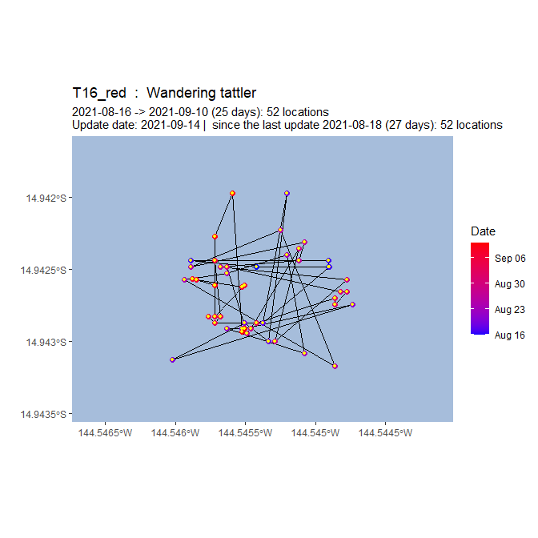
<p class="caption">The last ten days moves of the Sooty tern S09_red. Yellow dots for the new locations</p>
</div>

```
## figure c:/GIT/kivikuaka/output/map_new_T04_red.png
```

<div class="figure" style="text-align: center">
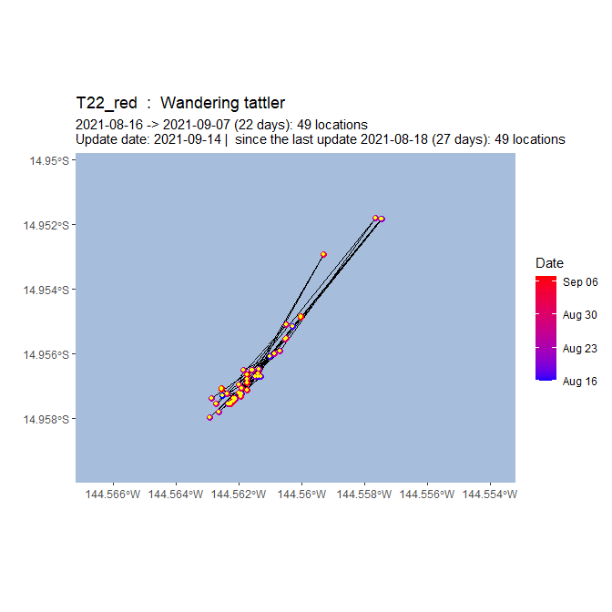
<p class="caption">The last ten days moves of the Wandering tattler T02_red. Yellow dots for the new locations</p>
</div>

```
## figure c:/GIT/kivikuaka/output/map_new_T05_red.png
```

<div class="figure" style="text-align: center">

<p class="caption">The last ten days moves of the Wandering tattler T04_red. Yellow dots for the new locations</p>
</div>

```
## figure c:/GIT/kivikuaka/output/map_new_T08_red.png
```

<div class="figure" style="text-align: center">

<p class="caption">The last ten days moves of the Wandering tattler T05_red. Yellow dots for the new locations</p>
</div>

```
## figure c:/GIT/kivikuaka/output/map_new_T10_red.png
```

<div class="figure" style="text-align: center">

<p class="caption">The last ten days moves of the Wandering tattler T08_red. Yellow dots for the new locations</p>
</div>

```
## figure c:/GIT/kivikuaka/output/map_new_T11_red.png
```

<div class="figure" style="text-align: center">

<p class="caption">The last ten days moves of the Wandering tattler T10_red. Yellow dots for the new locations</p>
</div>

```
## figure c:/GIT/kivikuaka/output/map_new_T13_red.png
```

<div class="figure" style="text-align: center">

<p class="caption">The last ten days moves of the Wandering tattler T11_red. Yellow dots for the new locations</p>
</div>

```
## figure c:/GIT/kivikuaka/output/map_new_T14_red.png
```

<div class="figure" style="text-align: center">

<p class="caption">The last ten days moves of the Wandering tattler T13_red. Yellow dots for the new locations</p>
</div>

```
## figure c:/GIT/kivikuaka/output/map_new_T15_red.png
```

<div class="figure" style="text-align: center">

<p class="caption">The last ten days moves of the Wandering tattler T14_red. Yellow dots for the new locations</p>
</div>

```
## figure c:/GIT/kivikuaka/output/map_new_T16_red.png
```

<div class="figure" style="text-align: center">

<p class="caption">The last ten days moves of the Wandering tattler T15_red. Yellow dots for the new locations</p>
</div>

```
## figure c:/GIT/kivikuaka/output/map_new_T18_red.png
```

<div class="figure" style="text-align: center">

<p class="caption">The last ten days moves of the Wandering tattler T16_red. Yellow dots for the new locations</p>
</div>

```
## figure c:/GIT/kivikuaka/output/map_new_T21_red.png
```

<div class="figure" style="text-align: center">

<p class="caption">The last ten days moves of the Wandering tattler T18_red. Yellow dots for the new locations</p>
</div>

```
## figure c:/GIT/kivikuaka/output/map_new_T23_red.png
```

<div class="figure" style="text-align: center">

<p class="caption">The last ten days moves of the Wandering tattler T21_red. Yellow dots for the new locations</p>
</div>

```
## figure c:/GIT/kivikuaka/output/map_new_T24_red.png
```

<div class="figure" style="text-align: center">

<p class="caption">The last ten days moves of the Wandering tattler T23_red. Yellow dots for the new locations</p>
</div><div class="figure" style="text-align: center">

<p class="caption">The last ten days moves of the Wandering tattler T24_red. Yellow dots for the new locations</p>
</div>


# The data base

## The birds


<div style="border: 1px solid #ddd; padding: 0px; overflow-y: scroll; height:300px; overflow-x: scroll; width:600px; "><table class="table table-hover" style="font-size: 11px; width: auto !important; margin-left: auto; margin-right: auto;">
<caption style="font-size: initial !important;">The birds</caption>
 <thead>
  <tr>
   <th style="text-align:left;position: sticky; top:0; background-color: #FFFFFF;position: sticky; top:0; background-color: #FFFFFF;"> bird_id </th>
   <th style="text-align:left;position: sticky; top:0; background-color: #FFFFFF;position: sticky; top:0; background-color: #FFFFFF;"> nick_name </th>
   <th style="text-align:left;position: sticky; top:0; background-color: #FFFFFF;position: sticky; top:0; background-color: #FFFFFF;"> taxon </th>
   <th style="text-align:right;position: sticky; top:0; background-color: #FFFFFF;position: sticky; top:0; background-color: #FFFFFF;"> id </th>
   <th style="text-align:left;position: sticky; top:0; background-color: #FFFFFF;position: sticky; top:0; background-color: #FFFFFF;"> ring_id </th>
   <th style="text-align:left;position: sticky; top:0; background-color: #FFFFFF;position: sticky; top:0; background-color: #FFFFFF;"> taxon_eng </th>
   <th style="text-align:left;position: sticky; top:0; background-color: #FFFFFF;position: sticky; top:0; background-color: #FFFFFF;"> taxon_fr </th>
   <th style="text-align:left;position: sticky; top:0; background-color: #FFFFFF;position: sticky; top:0; background-color: #FFFFFF;"> date_start </th>
   <th style="text-align:left;position: sticky; top:0; background-color: #FFFFFF;position: sticky; top:0; background-color: #FFFFFF;"> date_end </th>
   <th style="text-align:right;position: sticky; top:0; background-color: #FFFFFF;position: sticky; top:0; background-color: #FFFFFF;"> number_of_events </th>
   <th style="text-align:right;position: sticky; top:0; background-color: #FFFFFF;position: sticky; top:0; background-color: #FFFFFF;"> nb_day_silence </th>
   <th style="text-align:left;position: sticky; top:0; background-color: #FFFFFF;position: sticky; top:0; background-color: #FFFFFF;"> new </th>
   <th style="text-align:left;position: sticky; top:0; background-color: #FFFFFF;position: sticky; top:0; background-color: #FFFFFF;"> import_date </th>
  </tr>
 </thead>
<tbody>
  <tr>
   <td style="text-align:left;"> C00_red </td>
   <td style="text-align:left;"> Bruce </td>
   <td style="text-align:left;"> Numenius tahitiensis </td>
   <td style="text-align:right;"> 1427024022 </td>
   <td style="text-align:left;"> [FRP-FS114751] </td>
   <td style="text-align:left;"> Bristle-thighed curlew </td>
   <td style="text-align:left;"> Courlis d'Alaska </td>
   <td style="text-align:left;"> NA </td>
   <td style="text-align:left;"> NA </td>
   <td style="text-align:right;"> 0 </td>
   <td style="text-align:right;"> NA </td>
   <td style="text-align:left;"> TRUE </td>
   <td style="text-align:left;"> 2021-05-31 </td>
  </tr>
  <tr>
   <td style="text-align:left;"> C01_red </td>
   <td style="text-align:left;"> Teraimarama </td>
   <td style="text-align:left;"> Numenius tahitiensis </td>
   <td style="text-align:right;"> 1427025072 </td>
   <td style="text-align:left;"> [FRP-EC110531] </td>
   <td style="text-align:left;"> Bristle-thighed curlew </td>
   <td style="text-align:left;"> Courlis d'Alaska </td>
   <td style="text-align:left;"> 2021-02-23 </td>
   <td style="text-align:left;"> 2021-05-28 </td>
   <td style="text-align:right;"> 166 </td>
   <td style="text-align:right;"> 3 </td>
   <td style="text-align:left;"> TRUE </td>
   <td style="text-align:left;"> 2021-05-31 </td>
  </tr>
  <tr>
   <td style="text-align:left;"> C02_red </td>
   <td style="text-align:left;"> Temanu </td>
   <td style="text-align:left;"> Numenius tahitiensis </td>
   <td style="text-align:right;"> 1427025368 </td>
   <td style="text-align:left;"> [FRP-EC110532] </td>
   <td style="text-align:left;"> Bristle-thighed curlew </td>
   <td style="text-align:left;"> Courlis d'Alaska </td>
   <td style="text-align:left;"> 2021-03-24 </td>
   <td style="text-align:left;"> 2021-04-24 </td>
   <td style="text-align:right;"> 51 </td>
   <td style="text-align:right;"> 37 </td>
   <td style="text-align:left;"> TRUE </td>
   <td style="text-align:left;"> 2021-05-31 </td>
  </tr>
  <tr>
   <td style="text-align:left;"> C03_red </td>
   <td style="text-align:left;"> Manurere </td>
   <td style="text-align:left;"> Numenius tahitiensis </td>
   <td style="text-align:right;"> 1427025571 </td>
   <td style="text-align:left;"> [FRP-EC110533] </td>
   <td style="text-align:left;"> Bristle-thighed curlew </td>
   <td style="text-align:left;"> Courlis d'Alaska </td>
   <td style="text-align:left;"> 2021-02-24 </td>
   <td style="text-align:left;"> 2021-05-28 </td>
   <td style="text-align:right;"> 173 </td>
   <td style="text-align:right;"> 2 </td>
   <td style="text-align:left;"> TRUE </td>
   <td style="text-align:left;"> 2021-05-31 </td>
  </tr>
  <tr>
   <td style="text-align:left;"> C04_red </td>
   <td style="text-align:left;">  </td>
   <td style="text-align:left;"> Numenius tahitiensis </td>
   <td style="text-align:right;"> 1427025900 </td>
   <td style="text-align:left;"> [FRP-EC110534] </td>
   <td style="text-align:left;"> Bristle-thighed curlew </td>
   <td style="text-align:left;"> Courlis d'Alaska </td>
   <td style="text-align:left;"> 2021-02-27 </td>
   <td style="text-align:left;"> 2021-05-25 </td>
   <td style="text-align:right;"> 137 </td>
   <td style="text-align:right;"> 6 </td>
   <td style="text-align:left;"> TRUE </td>
   <td style="text-align:left;"> 2021-05-31 </td>
  </tr>
  <tr>
   <td style="text-align:left;"> C05_red </td>
   <td style="text-align:left;"> Heirua </td>
   <td style="text-align:left;"> Numenius tahitiensis </td>
   <td style="text-align:right;"> 1427026113 </td>
   <td style="text-align:left;"> [FRP-EC110535] </td>
   <td style="text-align:left;"> Bristle-thighed curlew </td>
   <td style="text-align:left;"> Courlis d'Alaska </td>
   <td style="text-align:left;"> 2021-02-14 </td>
   <td style="text-align:left;"> 2021-05-26 </td>
   <td style="text-align:right;"> 132 </td>
   <td style="text-align:right;"> 5 </td>
   <td style="text-align:left;"> TRUE </td>
   <td style="text-align:left;"> 2021-05-31 </td>
  </tr>
  <tr>
   <td style="text-align:left;"> C06_red </td>
   <td style="text-align:left;">  </td>
   <td style="text-align:left;"> Numenius tahitiensis </td>
   <td style="text-align:right;"> 1427026804 </td>
   <td style="text-align:left;"> [FRP-EC110536] </td>
   <td style="text-align:left;"> Bristle-thighed curlew </td>
   <td style="text-align:left;"> Courlis d'Alaska </td>
   <td style="text-align:left;"> 2021-02-26 </td>
   <td style="text-align:left;"> 2021-05-28 </td>
   <td style="text-align:right;"> 136 </td>
   <td style="text-align:right;"> 2 </td>
   <td style="text-align:left;"> TRUE </td>
   <td style="text-align:left;"> 2021-05-31 </td>
  </tr>
  <tr>
   <td style="text-align:left;"> C07_red </td>
   <td style="text-align:left;">  </td>
   <td style="text-align:left;"> Numenius tahitiensis </td>
   <td style="text-align:right;"> 1427027383 </td>
   <td style="text-align:left;"> [FRP-EC110537] </td>
   <td style="text-align:left;"> Bristle-thighed curlew </td>
   <td style="text-align:left;"> Courlis d'Alaska </td>
   <td style="text-align:left;"> 2021-03-01 </td>
   <td style="text-align:left;"> 2021-05-28 </td>
   <td style="text-align:right;"> 154 </td>
   <td style="text-align:right;"> 2 </td>
   <td style="text-align:left;"> TRUE </td>
   <td style="text-align:left;"> 2021-05-31 </td>
  </tr>
  <tr>
   <td style="text-align:left;"> C08_red </td>
   <td style="text-align:left;">  </td>
   <td style="text-align:left;"> Numenius tahitiensis </td>
   <td style="text-align:right;"> 1427028220 </td>
   <td style="text-align:left;"> [FRP-EC110538] </td>
   <td style="text-align:left;"> Bristle-thighed curlew </td>
   <td style="text-align:left;"> Courlis d'Alaska </td>
   <td style="text-align:left;"> 2021-02-27 </td>
   <td style="text-align:left;"> 2021-05-27 </td>
   <td style="text-align:right;"> 132 </td>
   <td style="text-align:right;"> 3 </td>
   <td style="text-align:left;"> TRUE </td>
   <td style="text-align:left;"> 2021-05-31 </td>
  </tr>
  <tr>
   <td style="text-align:left;"> C09_red </td>
   <td style="text-align:left;">  </td>
   <td style="text-align:left;"> Numenius tahitiensis </td>
   <td style="text-align:right;"> 1427028910 </td>
   <td style="text-align:left;"> [FRP-EC110539] </td>
   <td style="text-align:left;"> Bristle-thighed curlew </td>
   <td style="text-align:left;"> Courlis d'Alaska </td>
   <td style="text-align:left;"> 2021-02-25 </td>
   <td style="text-align:left;"> 2021-04-25 </td>
   <td style="text-align:right;"> 111 </td>
   <td style="text-align:right;"> 36 </td>
   <td style="text-align:left;"> TRUE </td>
   <td style="text-align:left;"> 2021-05-31 </td>
  </tr>
  <tr>
   <td style="text-align:left;"> C10_red </td>
   <td style="text-align:left;">  </td>
   <td style="text-align:left;"> Numenius tahitiensis </td>
   <td style="text-align:right;"> 1427029163 </td>
   <td style="text-align:left;"> FRP-EC110540 </td>
   <td style="text-align:left;"> Bristle-thighed curlew </td>
   <td style="text-align:left;"> Courlis d'Alaska </td>
   <td style="text-align:left;"> NA </td>
   <td style="text-align:left;"> NA </td>
   <td style="text-align:right;"> 0 </td>
   <td style="text-align:right;"> NA </td>
   <td style="text-align:left;"> TRUE </td>
   <td style="text-align:left;"> 2021-05-31 </td>
  </tr>
  <tr>
   <td style="text-align:left;"> C11_red </td>
   <td style="text-align:left;">  </td>
   <td style="text-align:left;"> Numenius tahitiensis </td>
   <td style="text-align:right;"> 1427030305 </td>
   <td style="text-align:left;"> FRP-EC110541 </td>
   <td style="text-align:left;"> Bristle-thighed curlew </td>
   <td style="text-align:left;"> Courlis d'Alaska </td>
   <td style="text-align:left;"> 2021-03-25 </td>
   <td style="text-align:left;"> 2021-05-28 </td>
   <td style="text-align:right;"> 91 </td>
   <td style="text-align:right;"> 2 </td>
   <td style="text-align:left;"> TRUE </td>
   <td style="text-align:left;"> 2021-05-31 </td>
  </tr>
  <tr>
   <td style="text-align:left;"> C12_red </td>
   <td style="text-align:left;">  </td>
   <td style="text-align:left;"> Numenius tahitiensis </td>
   <td style="text-align:right;"> 1427030482 </td>
   <td style="text-align:left;"> FRP-EC110542 </td>
   <td style="text-align:left;"> Bristle-thighed curlew </td>
   <td style="text-align:left;"> Courlis d'Alaska </td>
   <td style="text-align:left;"> 2021-03-01 </td>
   <td style="text-align:left;"> 2021-05-26 </td>
   <td style="text-align:right;"> 137 </td>
   <td style="text-align:right;"> 5 </td>
   <td style="text-align:left;"> TRUE </td>
   <td style="text-align:left;"> 2021-05-31 </td>
  </tr>
  <tr>
   <td style="text-align:left;"> S01_red </td>
   <td style="text-align:left;">  </td>
   <td style="text-align:left;"> Onychoprion fuscatus </td>
   <td style="text-align:right;"> 1427079626 </td>
   <td style="text-align:left;"> FRP-M86802 </td>
   <td style="text-align:left;"> Sooty tern </td>
   <td style="text-align:left;"> Sterne fuligineuse </td>
   <td style="text-align:left;"> NA </td>
   <td style="text-align:left;"> NA </td>
   <td style="text-align:right;"> 0 </td>
   <td style="text-align:right;"> NA </td>
   <td style="text-align:left;"> TRUE </td>
   <td style="text-align:left;"> 2021-05-31 </td>
  </tr>
  <tr>
   <td style="text-align:left;"> S02_red </td>
   <td style="text-align:left;">  </td>
   <td style="text-align:left;"> Onychoprion fuscatus </td>
   <td style="text-align:right;"> 1427080028 </td>
   <td style="text-align:left;"> FRP-M86803 </td>
   <td style="text-align:left;"> Sooty tern </td>
   <td style="text-align:left;"> Sterne fuligineuse </td>
   <td style="text-align:left;"> NA </td>
   <td style="text-align:left;"> NA </td>
   <td style="text-align:right;"> 0 </td>
   <td style="text-align:right;"> NA </td>
   <td style="text-align:left;"> TRUE </td>
   <td style="text-align:left;"> 2021-05-31 </td>
  </tr>
  <tr>
   <td style="text-align:left;"> S03_red </td>
   <td style="text-align:left;">  </td>
   <td style="text-align:left;"> Onychoprion fuscatus </td>
   <td style="text-align:right;"> 1427080447 </td>
   <td style="text-align:left;"> FRP-M86804 </td>
   <td style="text-align:left;"> Sooty tern </td>
   <td style="text-align:left;"> Sterne fuligineuse </td>
   <td style="text-align:left;"> 2021-03-25 </td>
   <td style="text-align:left;"> 2021-04-02 </td>
   <td style="text-align:right;"> 7 </td>
   <td style="text-align:right;"> 59 </td>
   <td style="text-align:left;"> TRUE </td>
   <td style="text-align:left;"> 2021-05-31 </td>
  </tr>
  <tr>
   <td style="text-align:left;"> S04_red </td>
   <td style="text-align:left;">  </td>
   <td style="text-align:left;"> Onychoprion fuscatus </td>
   <td style="text-align:right;"> 1427080684 </td>
   <td style="text-align:left;"> FRP-M86805 </td>
   <td style="text-align:left;"> Sooty tern </td>
   <td style="text-align:left;"> Sterne fuligineuse </td>
   <td style="text-align:left;"> 2021-02-11 </td>
   <td style="text-align:left;"> 2021-04-22 </td>
   <td style="text-align:right;"> 56 </td>
   <td style="text-align:right;"> 39 </td>
   <td style="text-align:left;"> TRUE </td>
   <td style="text-align:left;"> 2021-05-31 </td>
  </tr>
  <tr>
   <td style="text-align:left;"> S05_red </td>
   <td style="text-align:left;">  </td>
   <td style="text-align:left;"> Onychoprion fuscatus </td>
   <td style="text-align:right;"> 1427081105 </td>
   <td style="text-align:left;"> FRP-M86806 </td>
   <td style="text-align:left;"> Sooty tern </td>
   <td style="text-align:left;"> Sterne fuligineuse </td>
   <td style="text-align:left;"> NA </td>
   <td style="text-align:left;"> NA </td>
   <td style="text-align:right;"> 0 </td>
   <td style="text-align:right;"> NA </td>
   <td style="text-align:left;"> TRUE </td>
   <td style="text-align:left;"> 2021-05-31 </td>
  </tr>
  <tr>
   <td style="text-align:left;"> S06_red </td>
   <td style="text-align:left;">  </td>
   <td style="text-align:left;"> Onychoprion fuscatus </td>
   <td style="text-align:right;"> 1427081220 </td>
   <td style="text-align:left;"> FRP-M86807 </td>
   <td style="text-align:left;"> Sooty tern </td>
   <td style="text-align:left;"> Sterne fuligineuse </td>
   <td style="text-align:left;"> 2021-02-12 </td>
   <td style="text-align:left;"> 2021-04-12 </td>
   <td style="text-align:right;"> 35 </td>
   <td style="text-align:right;"> 49 </td>
   <td style="text-align:left;"> TRUE </td>
   <td style="text-align:left;"> 2021-05-31 </td>
  </tr>
  <tr>
   <td style="text-align:left;"> S07_red </td>
   <td style="text-align:left;">  </td>
   <td style="text-align:left;"> Onychoprion fuscatus </td>
   <td style="text-align:right;"> 1427081443 </td>
   <td style="text-align:left;"> FRP-M86808 </td>
   <td style="text-align:left;"> Sooty tern </td>
   <td style="text-align:left;"> Sterne fuligineuse </td>
   <td style="text-align:left;"> NA </td>
   <td style="text-align:left;"> NA </td>
   <td style="text-align:right;"> 0 </td>
   <td style="text-align:right;"> NA </td>
   <td style="text-align:left;"> TRUE </td>
   <td style="text-align:left;"> 2021-05-31 </td>
  </tr>
  <tr>
   <td style="text-align:left;"> S08_red </td>
   <td style="text-align:left;">  </td>
   <td style="text-align:left;"> Onychoprion fuscatus </td>
   <td style="text-align:right;"> 1427082111 </td>
   <td style="text-align:left;"> FRP-M86809 </td>
   <td style="text-align:left;"> Sooty tern </td>
   <td style="text-align:left;"> Sterne fuligineuse </td>
   <td style="text-align:left;"> 2021-02-05 </td>
   <td style="text-align:left;"> 2021-05-07 </td>
   <td style="text-align:right;"> 59 </td>
   <td style="text-align:right;"> 24 </td>
   <td style="text-align:left;"> TRUE </td>
   <td style="text-align:left;"> 2021-05-31 </td>
  </tr>
  <tr>
   <td style="text-align:left;"> S09_red </td>
   <td style="text-align:left;">  </td>
   <td style="text-align:left;"> Onychoprion fuscatus </td>
   <td style="text-align:right;"> 1427082950 </td>
   <td style="text-align:left;"> FRP-M86810 </td>
   <td style="text-align:left;"> Sooty tern </td>
   <td style="text-align:left;"> Sterne fuligineuse </td>
   <td style="text-align:left;"> 2021-01-29 </td>
   <td style="text-align:left;"> 2021-05-02 </td>
   <td style="text-align:right;"> 36 </td>
   <td style="text-align:right;"> 29 </td>
   <td style="text-align:left;"> TRUE </td>
   <td style="text-align:left;"> 2021-05-31 </td>
  </tr>
  <tr>
   <td style="text-align:left;"> S10_red </td>
   <td style="text-align:left;">  </td>
   <td style="text-align:left;"> Onychoprion fuscatus </td>
   <td style="text-align:right;"> 1427083089 </td>
   <td style="text-align:left;"> FRP-M86811 </td>
   <td style="text-align:left;"> Sooty tern </td>
   <td style="text-align:left;"> Sterne fuligineuse </td>
   <td style="text-align:left;"> NA </td>
   <td style="text-align:left;"> NA </td>
   <td style="text-align:right;"> 0 </td>
   <td style="text-align:right;"> NA </td>
   <td style="text-align:left;"> TRUE </td>
   <td style="text-align:left;"> 2021-05-31 </td>
  </tr>
  <tr>
   <td style="text-align:left;"> S11_red </td>
   <td style="text-align:left;">  </td>
   <td style="text-align:left;"> Onychoprion fuscatus </td>
   <td style="text-align:right;"> 1427083579 </td>
   <td style="text-align:left;"> FRP-M86812 </td>
   <td style="text-align:left;"> Sooty tern </td>
   <td style="text-align:left;"> Sterne fuligineuse </td>
   <td style="text-align:left;"> 2021-01-27 </td>
   <td style="text-align:left;"> 2021-04-16 </td>
   <td style="text-align:right;"> 40 </td>
   <td style="text-align:right;"> 45 </td>
   <td style="text-align:left;"> TRUE </td>
   <td style="text-align:left;"> 2021-05-31 </td>
  </tr>
  <tr>
   <td style="text-align:left;"> S12_red </td>
   <td style="text-align:left;">  </td>
   <td style="text-align:left;"> Onychoprion fuscatus </td>
   <td style="text-align:right;"> 1427083709 </td>
   <td style="text-align:left;"> FRP-M86813 </td>
   <td style="text-align:left;"> Sooty tern </td>
   <td style="text-align:left;"> Sterne fuligineuse </td>
   <td style="text-align:left;"> 2021-02-21 </td>
   <td style="text-align:left;"> 2021-04-20 </td>
   <td style="text-align:right;"> 53 </td>
   <td style="text-align:right;"> 41 </td>
   <td style="text-align:left;"> TRUE </td>
   <td style="text-align:left;"> 2021-05-31 </td>
  </tr>
  <tr>
   <td style="text-align:left;"> P00_red </td>
   <td style="text-align:left;">  </td>
   <td style="text-align:left;"> Pluvialis fulva </td>
   <td style="text-align:right;"> 1427030763 </td>
   <td style="text-align:left;"> FRP-M86801 </td>
   <td style="text-align:left;"> Pacific golden plover </td>
   <td style="text-align:left;"> Pluvier fauve </td>
   <td style="text-align:left;"> 2021-03-01 </td>
   <td style="text-align:left;"> 2021-04-30 </td>
   <td style="text-align:right;"> 107 </td>
   <td style="text-align:right;"> 31 </td>
   <td style="text-align:left;"> TRUE </td>
   <td style="text-align:left;"> 2021-05-31 </td>
  </tr>
  <tr>
   <td style="text-align:left;"> P01_red </td>
   <td style="text-align:left;">  </td>
   <td style="text-align:left;"> Pluvialis fulva </td>
   <td style="text-align:right;"> 1427031329 </td>
   <td style="text-align:left;"> FRP-M86814 </td>
   <td style="text-align:left;"> Pacific golden plover </td>
   <td style="text-align:left;"> Pluvier fauve </td>
   <td style="text-align:left;"> 2021-02-11 </td>
   <td style="text-align:left;"> 2021-05-26 </td>
   <td style="text-align:right;"> 127 </td>
   <td style="text-align:right;"> 5 </td>
   <td style="text-align:left;"> TRUE </td>
   <td style="text-align:left;"> 2021-05-31 </td>
  </tr>
  <tr>
   <td style="text-align:left;"> P03_red </td>
   <td style="text-align:left;">  </td>
   <td style="text-align:left;"> Pluvialis fulva </td>
   <td style="text-align:right;"> 1427031617 </td>
   <td style="text-align:left;"> FRP-M86816 </td>
   <td style="text-align:left;"> Pacific golden plover </td>
   <td style="text-align:left;"> Pluvier fauve </td>
   <td style="text-align:left;"> 2021-03-08 </td>
   <td style="text-align:left;"> 2021-03-31 </td>
   <td style="text-align:right;"> 40 </td>
   <td style="text-align:right;"> 60 </td>
   <td style="text-align:left;"> TRUE </td>
   <td style="text-align:left;"> 2021-05-31 </td>
  </tr>
  <tr>
   <td style="text-align:left;"> P04_red </td>
   <td style="text-align:left;">  </td>
   <td style="text-align:left;"> Pluvialis fulva </td>
   <td style="text-align:right;"> 1427031920 </td>
   <td style="text-align:left;"> FRP-M86817 </td>
   <td style="text-align:left;"> Pacific golden plover </td>
   <td style="text-align:left;"> Pluvier fauve </td>
   <td style="text-align:left;"> 2021-02-28 </td>
   <td style="text-align:left;"> 2021-04-09 </td>
   <td style="text-align:right;"> 72 </td>
   <td style="text-align:right;"> 52 </td>
   <td style="text-align:left;"> TRUE </td>
   <td style="text-align:left;"> 2021-05-31 </td>
  </tr>
  <tr>
   <td style="text-align:left;"> P05_red </td>
   <td style="text-align:left;">  </td>
   <td style="text-align:left;"> Pluvialis fulva </td>
   <td style="text-align:right;"> 1427032205 </td>
   <td style="text-align:left;"> FRP-M86818 </td>
   <td style="text-align:left;"> Pacific golden plover </td>
   <td style="text-align:left;"> Pluvier fauve </td>
   <td style="text-align:left;"> 2021-03-07 </td>
   <td style="text-align:left;"> 2021-04-23 </td>
   <td style="text-align:right;"> 77 </td>
   <td style="text-align:right;"> 38 </td>
   <td style="text-align:left;"> TRUE </td>
   <td style="text-align:left;"> 2021-05-31 </td>
  </tr>
  <tr>
   <td style="text-align:left;"> P06_red </td>
   <td style="text-align:left;">  </td>
   <td style="text-align:left;"> Pluvialis fulva </td>
   <td style="text-align:right;"> 1427032392 </td>
   <td style="text-align:left;"> FRP-M86819 </td>
   <td style="text-align:left;"> Pacific golden plover </td>
   <td style="text-align:left;"> Pluvier fauve </td>
   <td style="text-align:left;"> 2021-03-06 </td>
   <td style="text-align:left;"> 2021-04-22 </td>
   <td style="text-align:right;"> 94 </td>
   <td style="text-align:right;"> 39 </td>
   <td style="text-align:left;"> TRUE </td>
   <td style="text-align:left;"> 2021-05-31 </td>
  </tr>
  <tr>
   <td style="text-align:left;"> P07_red </td>
   <td style="text-align:left;">  </td>
   <td style="text-align:left;"> Pluvialis fulva </td>
   <td style="text-align:right;"> 1427033130 </td>
   <td style="text-align:left;"> FRP-M86820 </td>
   <td style="text-align:left;"> Pacific golden plover </td>
   <td style="text-align:left;"> Pluvier fauve </td>
   <td style="text-align:left;"> 2021-02-27 </td>
   <td style="text-align:left;"> 2021-04-19 </td>
   <td style="text-align:right;"> 99 </td>
   <td style="text-align:right;"> 42 </td>
   <td style="text-align:left;"> TRUE </td>
   <td style="text-align:left;"> 2021-05-31 </td>
  </tr>
  <tr>
   <td style="text-align:left;"> P08_red </td>
   <td style="text-align:left;">  </td>
   <td style="text-align:left;"> Pluvialis fulva </td>
   <td style="text-align:right;"> 1427033927 </td>
   <td style="text-align:left;"> FRP-M86821 </td>
   <td style="text-align:left;"> Pacific golden plover </td>
   <td style="text-align:left;"> Pluvier fauve </td>
   <td style="text-align:left;"> 2021-02-26 </td>
   <td style="text-align:left;"> 2021-04-14 </td>
   <td style="text-align:right;"> 80 </td>
   <td style="text-align:right;"> 46 </td>
   <td style="text-align:left;"> TRUE </td>
   <td style="text-align:left;"> 2021-05-31 </td>
  </tr>
  <tr>
   <td style="text-align:left;"> T00_red </td>
   <td style="text-align:left;">  </td>
   <td style="text-align:left;"> Tringa incana </td>
   <td style="text-align:right;"> 1427035145 </td>
   <td style="text-align:left;"> FRP-GE43201 </td>
   <td style="text-align:left;"> Wandering tattler </td>
   <td style="text-align:left;"> Chevalier errant </td>
   <td style="text-align:left;"> NA </td>
   <td style="text-align:left;"> NA </td>
   <td style="text-align:right;"> 0 </td>
   <td style="text-align:right;"> NA </td>
   <td style="text-align:left;"> TRUE </td>
   <td style="text-align:left;"> 2021-05-31 </td>
  </tr>
  <tr>
   <td style="text-align:left;"> T02_red </td>
   <td style="text-align:left;">  </td>
   <td style="text-align:left;"> Tringa incana </td>
   <td style="text-align:right;"> 1427036090 </td>
   <td style="text-align:left;"> FRP-GE43203 </td>
   <td style="text-align:left;"> Wandering tattler </td>
   <td style="text-align:left;"> Chevalier errant </td>
   <td style="text-align:left;"> 2021-02-22 </td>
   <td style="text-align:left;"> 2021-05-08 </td>
   <td style="text-align:right;"> 113 </td>
   <td style="text-align:right;"> 23 </td>
   <td style="text-align:left;"> TRUE </td>
   <td style="text-align:left;"> 2021-05-31 </td>
  </tr>
  <tr>
   <td style="text-align:left;"> T03_red </td>
   <td style="text-align:left;">  </td>
   <td style="text-align:left;"> Tringa incana </td>
   <td style="text-align:right;"> 1427036786 </td>
   <td style="text-align:left;"> FRP-GE43204 </td>
   <td style="text-align:left;"> Wandering tattler </td>
   <td style="text-align:left;"> Chevalier errant </td>
   <td style="text-align:left;"> 2021-03-09 </td>
   <td style="text-align:left;"> 2021-03-28 </td>
   <td style="text-align:right;"> 38 </td>
   <td style="text-align:right;"> 64 </td>
   <td style="text-align:left;"> TRUE </td>
   <td style="text-align:left;"> 2021-05-31 </td>
  </tr>
  <tr>
   <td style="text-align:left;"> T04_red </td>
   <td style="text-align:left;">  </td>
   <td style="text-align:left;"> Tringa incana </td>
   <td style="text-align:right;"> 1427037148 </td>
   <td style="text-align:left;"> FRP-GE43205 </td>
   <td style="text-align:left;"> Wandering tattler </td>
   <td style="text-align:left;"> Chevalier errant </td>
   <td style="text-align:left;"> 2021-02-26 </td>
   <td style="text-align:left;"> 2021-05-26 </td>
   <td style="text-align:right;"> 120 </td>
   <td style="text-align:right;"> 5 </td>
   <td style="text-align:left;"> TRUE </td>
   <td style="text-align:left;"> 2021-05-31 </td>
  </tr>
  <tr>
   <td style="text-align:left;"> T05_red </td>
   <td style="text-align:left;">  </td>
   <td style="text-align:left;"> Tringa incana </td>
   <td style="text-align:right;"> 1427037306 </td>
   <td style="text-align:left;"> FRP-GE43206 </td>
   <td style="text-align:left;"> Wandering tattler </td>
   <td style="text-align:left;"> Chevalier errant </td>
   <td style="text-align:left;"> 2021-03-15 </td>
   <td style="text-align:left;"> 2021-05-26 </td>
   <td style="text-align:right;"> 102 </td>
   <td style="text-align:right;"> 5 </td>
   <td style="text-align:left;"> TRUE </td>
   <td style="text-align:left;"> 2021-05-31 </td>
  </tr>
  <tr>
   <td style="text-align:left;"> T06_red </td>
   <td style="text-align:left;">  </td>
   <td style="text-align:left;"> Tringa incana </td>
   <td style="text-align:right;"> 1427037483 </td>
   <td style="text-align:left;"> FRP-GE43209 </td>
   <td style="text-align:left;"> Wandering tattler </td>
   <td style="text-align:left;"> Chevalier errant </td>
   <td style="text-align:left;"> 2021-03-09 </td>
   <td style="text-align:left;"> 2021-04-24 </td>
   <td style="text-align:right;"> 35 </td>
   <td style="text-align:right;"> 37 </td>
   <td style="text-align:left;"> TRUE </td>
   <td style="text-align:left;"> 2021-05-31 </td>
  </tr>
  <tr>
   <td style="text-align:left;"> T08_red </td>
   <td style="text-align:left;">  </td>
   <td style="text-align:left;"> Tringa incana </td>
   <td style="text-align:right;"> 1427037701 </td>
   <td style="text-align:left;"> FRP-GE43208 </td>
   <td style="text-align:left;"> Wandering tattler </td>
   <td style="text-align:left;"> Chevalier errant </td>
   <td style="text-align:left;"> 2021-03-02 </td>
   <td style="text-align:left;"> 2021-05-26 </td>
   <td style="text-align:right;"> 141 </td>
   <td style="text-align:right;"> 5 </td>
   <td style="text-align:left;"> TRUE </td>
   <td style="text-align:left;"> 2021-05-31 </td>
  </tr>
  <tr>
   <td style="text-align:left;"> T09_red </td>
   <td style="text-align:left;">  </td>
   <td style="text-align:left;"> Tringa incana </td>
   <td style="text-align:right;"> 1427062016 </td>
   <td style="text-align:left;"> FRP-GE43211 </td>
   <td style="text-align:left;"> Wandering tattler </td>
   <td style="text-align:left;"> Chevalier errant </td>
   <td style="text-align:left;"> 2021-02-26 </td>
   <td style="text-align:left;"> 2021-04-07 </td>
   <td style="text-align:right;"> 60 </td>
   <td style="text-align:right;"> 54 </td>
   <td style="text-align:left;"> TRUE </td>
   <td style="text-align:left;"> 2021-05-31 </td>
  </tr>
  <tr>
   <td style="text-align:left;"> T10_red </td>
   <td style="text-align:left;">  </td>
   <td style="text-align:left;"> Tringa incana </td>
   <td style="text-align:right;"> 1427062324 </td>
   <td style="text-align:left;"> FRP-GE43212 </td>
   <td style="text-align:left;"> Wandering tattler </td>
   <td style="text-align:left;"> Chevalier errant </td>
   <td style="text-align:left;"> 2021-02-27 </td>
   <td style="text-align:left;"> 2021-05-18 </td>
   <td style="text-align:right;"> 130 </td>
   <td style="text-align:right;"> 13 </td>
   <td style="text-align:left;"> TRUE </td>
   <td style="text-align:left;"> 2021-05-31 </td>
  </tr>
  <tr>
   <td style="text-align:left;"> T11_red </td>
   <td style="text-align:left;">  </td>
   <td style="text-align:left;"> Tringa incana </td>
   <td style="text-align:right;"> 1427062799 </td>
   <td style="text-align:left;"> FRP-GE43213 </td>
   <td style="text-align:left;"> Wandering tattler </td>
   <td style="text-align:left;"> Chevalier errant </td>
   <td style="text-align:left;"> 2021-02-24 </td>
   <td style="text-align:left;"> 2021-05-13 </td>
   <td style="text-align:right;"> 87 </td>
   <td style="text-align:right;"> 18 </td>
   <td style="text-align:left;"> TRUE </td>
   <td style="text-align:left;"> 2021-05-31 </td>
  </tr>
  <tr>
   <td style="text-align:left;"> T12_red </td>
   <td style="text-align:left;">  </td>
   <td style="text-align:left;"> Tringa incana </td>
   <td style="text-align:right;"> 1427063248 </td>
   <td style="text-align:left;"> FRP-GE43214 </td>
   <td style="text-align:left;"> Wandering tattler </td>
   <td style="text-align:left;"> Chevalier errant </td>
   <td style="text-align:left;"> NA </td>
   <td style="text-align:left;"> NA </td>
   <td style="text-align:right;"> 0 </td>
   <td style="text-align:right;"> NA </td>
   <td style="text-align:left;"> TRUE </td>
   <td style="text-align:left;"> 2021-05-31 </td>
  </tr>
  <tr>
   <td style="text-align:left;"> T13_red </td>
   <td style="text-align:left;">  </td>
   <td style="text-align:left;"> Tringa incana </td>
   <td style="text-align:right;"> 1427063693 </td>
   <td style="text-align:left;"> FRP-GE43215 </td>
   <td style="text-align:left;"> Wandering tattler </td>
   <td style="text-align:left;"> Chevalier errant </td>
   <td style="text-align:left;"> 2021-02-27 </td>
   <td style="text-align:left;"> 2021-05-25 </td>
   <td style="text-align:right;"> 126 </td>
   <td style="text-align:right;"> 5 </td>
   <td style="text-align:left;"> TRUE </td>
   <td style="text-align:left;"> 2021-05-31 </td>
  </tr>
  <tr>
   <td style="text-align:left;"> T14_red </td>
   <td style="text-align:left;">  </td>
   <td style="text-align:left;"> Tringa incana </td>
   <td style="text-align:right;"> 1427063998 </td>
   <td style="text-align:left;"> FRP-GE43216 </td>
   <td style="text-align:left;"> Wandering tattler </td>
   <td style="text-align:left;"> Chevalier errant </td>
   <td style="text-align:left;"> 2021-02-28 </td>
   <td style="text-align:left;"> 2021-05-25 </td>
   <td style="text-align:right;"> 129 </td>
   <td style="text-align:right;"> 5 </td>
   <td style="text-align:left;"> TRUE </td>
   <td style="text-align:left;"> 2021-05-31 </td>
  </tr>
  <tr>
   <td style="text-align:left;"> T15_red </td>
   <td style="text-align:left;">  </td>
   <td style="text-align:left;"> Tringa incana </td>
   <td style="text-align:right;"> 1427076616 </td>
   <td style="text-align:left;"> FRP-GE43217 </td>
   <td style="text-align:left;"> Wandering tattler </td>
   <td style="text-align:left;"> Chevalier errant </td>
   <td style="text-align:left;"> 2021-03-06 </td>
   <td style="text-align:left;"> 2021-05-25 </td>
   <td style="text-align:right;"> 145 </td>
   <td style="text-align:right;"> 6 </td>
   <td style="text-align:left;"> TRUE </td>
   <td style="text-align:left;"> 2021-05-31 </td>
  </tr>
  <tr>
   <td style="text-align:left;"> T16_red </td>
   <td style="text-align:left;">  </td>
   <td style="text-align:left;"> Tringa incana </td>
   <td style="text-align:right;"> 1427076894 </td>
   <td style="text-align:left;"> FRP-GE43218 </td>
   <td style="text-align:left;"> Wandering tattler </td>
   <td style="text-align:left;"> Chevalier errant </td>
   <td style="text-align:left;"> 2021-03-09 </td>
   <td style="text-align:left;"> 2021-05-25 </td>
   <td style="text-align:right;"> 132 </td>
   <td style="text-align:right;"> 5 </td>
   <td style="text-align:left;"> TRUE </td>
   <td style="text-align:left;"> 2021-05-31 </td>
  </tr>
  <tr>
   <td style="text-align:left;"> T18_red </td>
   <td style="text-align:left;">  </td>
   <td style="text-align:left;"> Tringa incana </td>
   <td style="text-align:right;"> 1427085442 </td>
   <td style="text-align:left;"> FRP-GE43220 </td>
   <td style="text-align:left;"> Wandering tattler </td>
   <td style="text-align:left;"> Chevalier errant </td>
   <td style="text-align:left;"> 2021-03-16 </td>
   <td style="text-align:left;"> 2021-05-25 </td>
   <td style="text-align:right;"> 80 </td>
   <td style="text-align:right;"> 5 </td>
   <td style="text-align:left;"> TRUE </td>
   <td style="text-align:left;"> 2021-05-31 </td>
  </tr>
  <tr>
   <td style="text-align:left;"> T19_red </td>
   <td style="text-align:left;">  </td>
   <td style="text-align:left;"> Tringa incana </td>
   <td style="text-align:right;"> 1427077109 </td>
   <td style="text-align:left;"> FRP-GE43221 </td>
   <td style="text-align:left;"> Wandering tattler </td>
   <td style="text-align:left;"> Chevalier errant </td>
   <td style="text-align:left;"> 2021-02-19 </td>
   <td style="text-align:left;"> 2021-04-03 </td>
   <td style="text-align:right;"> 20 </td>
   <td style="text-align:right;"> 58 </td>
   <td style="text-align:left;"> TRUE </td>
   <td style="text-align:left;"> 2021-05-31 </td>
  </tr>
  <tr>
   <td style="text-align:left;"> T20_red </td>
   <td style="text-align:left;">  </td>
   <td style="text-align:left;"> Tringa incana </td>
   <td style="text-align:right;"> 1427077281 </td>
   <td style="text-align:left;"> FRP-GE43222 </td>
   <td style="text-align:left;"> Wandering tattler </td>
   <td style="text-align:left;"> Chevalier errant </td>
   <td style="text-align:left;"> 2021-03-15 </td>
   <td style="text-align:left;"> 2021-04-08 </td>
   <td style="text-align:right;"> 47 </td>
   <td style="text-align:right;"> 53 </td>
   <td style="text-align:left;"> TRUE </td>
   <td style="text-align:left;"> 2021-05-31 </td>
  </tr>
  <tr>
   <td style="text-align:left;"> T21_red </td>
   <td style="text-align:left;">  </td>
   <td style="text-align:left;"> Tringa incana </td>
   <td style="text-align:right;"> 1427077398 </td>
   <td style="text-align:left;"> FRP-GE43223 </td>
   <td style="text-align:left;"> Wandering tattler </td>
   <td style="text-align:left;"> Chevalier errant </td>
   <td style="text-align:left;"> 2021-03-23 </td>
   <td style="text-align:left;"> 2021-05-22 </td>
   <td style="text-align:right;"> 98 </td>
   <td style="text-align:right;"> 9 </td>
   <td style="text-align:left;"> TRUE </td>
   <td style="text-align:left;"> 2021-05-31 </td>
  </tr>
  <tr>
   <td style="text-align:left;"> T22_red </td>
   <td style="text-align:left;">  </td>
   <td style="text-align:left;"> Tringa incana </td>
   <td style="text-align:right;"> 1427077690 </td>
   <td style="text-align:left;"> FRP-GE43224 </td>
   <td style="text-align:left;"> Wandering tattler </td>
   <td style="text-align:left;"> Chevalier errant </td>
   <td style="text-align:left;"> 2021-03-07 </td>
   <td style="text-align:left;"> 2021-04-25 </td>
   <td style="text-align:right;"> 38 </td>
   <td style="text-align:right;"> 36 </td>
   <td style="text-align:left;"> TRUE </td>
   <td style="text-align:left;"> 2021-05-31 </td>
  </tr>
  <tr>
   <td style="text-align:left;"> T23_red </td>
   <td style="text-align:left;">  </td>
   <td style="text-align:left;"> Tringa incana </td>
   <td style="text-align:right;"> 1427077967 </td>
   <td style="text-align:left;"> FRP-GE43225 </td>
   <td style="text-align:left;"> Wandering tattler </td>
   <td style="text-align:left;"> Chevalier errant </td>
   <td style="text-align:left;"> 2021-02-26 </td>
   <td style="text-align:left;"> 2021-05-24 </td>
   <td style="text-align:right;"> 110 </td>
   <td style="text-align:right;"> 6 </td>
   <td style="text-align:left;"> TRUE </td>
   <td style="text-align:left;"> 2021-05-31 </td>
  </tr>
  <tr>
   <td style="text-align:left;"> T24_red </td>
   <td style="text-align:left;">  </td>
   <td style="text-align:left;"> Tringa incana </td>
   <td style="text-align:right;"> 1427078483 </td>
   <td style="text-align:left;"> FRP-GE43226 </td>
   <td style="text-align:left;"> Wandering tattler </td>
   <td style="text-align:left;"> Chevalier errant </td>
   <td style="text-align:left;"> 2021-03-03 </td>
   <td style="text-align:left;"> 2021-05-26 </td>
   <td style="text-align:right;"> 139 </td>
   <td style="text-align:right;"> 5 </td>
   <td style="text-align:left;"> TRUE </td>
   <td style="text-align:left;"> 2021-05-31 </td>
  </tr>
  <tr>
   <td style="text-align:left;"> T25_red </td>
   <td style="text-align:left;">  </td>
   <td style="text-align:left;"> Tringa incana </td>
   <td style="text-align:right;"> 1427078811 </td>
   <td style="text-align:left;"> FRP-GE43227 </td>
   <td style="text-align:left;"> Wandering tattler </td>
   <td style="text-align:left;"> Chevalier errant </td>
   <td style="text-align:left;"> 2021-02-22 </td>
   <td style="text-align:left;"> 2021-04-24 </td>
   <td style="text-align:right;"> 84 </td>
   <td style="text-align:right;"> 37 </td>
   <td style="text-align:left;"> TRUE </td>
   <td style="text-align:left;"> 2021-05-31 </td>
  </tr>
</tbody>
</table></div>

## The events

The events correspond to the whole bird's location get from movebank. 

<div style="border: 1px solid #ddd; padding: 0px; overflow-y: scroll; height:300px; overflow-x: scroll; width:600px; "><table class="table table-hover" style="font-size: 11px; width: auto !important; margin-left: auto; margin-right: auto;">
<caption style="font-size: initial !important;">The event data</caption>
 <thead>
  <tr>
   <th style="text-align:left;position: sticky; top:0; background-color: #FFFFFF;position: sticky; top:0; background-color: #FFFFFF;"> event_id </th>
   <th style="text-align:right;position: sticky; top:0; background-color: #FFFFFF;position: sticky; top:0; background-color: #FFFFFF;"> individual_id </th>
   <th style="text-align:left;position: sticky; top:0; background-color: #FFFFFF;position: sticky; top:0; background-color: #FFFFFF;"> bird_id </th>
   <th style="text-align:left;position: sticky; top:0; background-color: #FFFFFF;position: sticky; top:0; background-color: #FFFFFF;"> nick_name </th>
   <th style="text-align:left;position: sticky; top:0; background-color: #FFFFFF;position: sticky; top:0; background-color: #FFFFFF;"> taxon </th>
   <th style="text-align:left;position: sticky; top:0; background-color: #FFFFFF;position: sticky; top:0; background-color: #FFFFFF;"> timestamp </th>
   <th style="text-align:right;position: sticky; top:0; background-color: #FFFFFF;position: sticky; top:0; background-color: #FFFFFF;"> location_lat </th>
   <th style="text-align:right;position: sticky; top:0; background-color: #FFFFFF;position: sticky; top:0; background-color: #FFFFFF;"> location_long </th>
   <th style="text-align:right;position: sticky; top:0; background-color: #FFFFFF;position: sticky; top:0; background-color: #FFFFFF;"> tag_id </th>
   <th style="text-align:left;position: sticky; top:0; background-color: #FFFFFF;position: sticky; top:0; background-color: #FFFFFF;"> taxon_fr </th>
   <th style="text-align:left;position: sticky; top:0; background-color: #FFFFFF;position: sticky; top:0; background-color: #FFFFFF;"> taxon_eng </th>
   <th style="text-align:left;position: sticky; top:0; background-color: #FFFFFF;position: sticky; top:0; background-color: #FFFFFF;"> date </th>
   <th style="text-align:right;position: sticky; top:0; background-color: #FFFFFF;position: sticky; top:0; background-color: #FFFFFF;"> julian </th>
   <th style="text-align:right;position: sticky; top:0; background-color: #FFFFFF;position: sticky; top:0; background-color: #FFFFFF;"> hour_trunc </th>
   <th style="text-align:right;position: sticky; top:0; background-color: #FFFFFF;position: sticky; top:0; background-color: #FFFFFF;"> hour_float </th>
   <th style="text-align:left;position: sticky; top:0; background-color: #FFFFFF;position: sticky; top:0; background-color: #FFFFFF;"> import_date </th>
   <th style="text-align:left;position: sticky; top:0; background-color: #FFFFFF;position: sticky; top:0; background-color: #FFFFFF;"> new </th>
   <th style="text-align:left;position: sticky; top:0; background-color: #FFFFFF;position: sticky; top:0; background-color: #FFFFFF;"> db_date </th>
   <th style="text-align:left;position: sticky; top:0; background-color: #FFFFFF;position: sticky; top:0; background-color: #FFFFFF;"> hms </th>
   <th style="text-align:right;position: sticky; top:0; background-color: #FFFFFF;position: sticky; top:0; background-color: #FFFFFF;"> nb_data_by_day </th>
  </tr>
 </thead>
<tbody>
  <tr>
   <td style="text-align:left;"> 1427025072_20210223220200 </td>
   <td style="text-align:right;"> 1427025072 </td>
   <td style="text-align:left;"> C01_red </td>
   <td style="text-align:left;"> Teraimarama </td>
   <td style="text-align:left;"> Numenius tahitiensis </td>
   <td style="text-align:left;"> 2021-02-23 22:02:00.000 </td>
   <td style="text-align:right;"> -15.10084 </td>
   <td style="text-align:right;"> -147.9408 </td>
   <td style="text-align:right;"> 1387222390 </td>
   <td style="text-align:left;"> Courlis d'Alaska </td>
   <td style="text-align:left;"> Bristle-thighed curlew </td>
   <td style="text-align:left;"> 2021-02-23 </td>
   <td style="text-align:right;"> 54 </td>
   <td style="text-align:right;"> 22 </td>
   <td style="text-align:right;"> 22.03 </td>
   <td style="text-align:left;"> 2021-04-22 </td>
   <td style="text-align:left;"> FALSE </td>
   <td style="text-align:left;"> 2021-05-31 09:49:38 </td>
   <td style="text-align:left;"> 2021-05-31 22:02:00 </td>
   <td style="text-align:right;"> 1 </td>
  </tr>
  <tr>
   <td style="text-align:left;"> 1427025072_20210224000800 </td>
   <td style="text-align:right;"> 1427025072 </td>
   <td style="text-align:left;"> C01_red </td>
   <td style="text-align:left;"> Teraimarama </td>
   <td style="text-align:left;"> Numenius tahitiensis </td>
   <td style="text-align:left;"> 2021-02-24 00:08:00.000 </td>
   <td style="text-align:right;"> -15.11363 </td>
   <td style="text-align:right;"> -147.9413 </td>
   <td style="text-align:right;"> 1387222390 </td>
   <td style="text-align:left;"> Courlis d'Alaska </td>
   <td style="text-align:left;"> Bristle-thighed curlew </td>
   <td style="text-align:left;"> 2021-02-24 </td>
   <td style="text-align:right;"> 55 </td>
   <td style="text-align:right;"> 0 </td>
   <td style="text-align:right;"> 0.03 </td>
   <td style="text-align:left;"> 2021-04-22 </td>
   <td style="text-align:left;"> FALSE </td>
   <td style="text-align:left;"> 2021-05-31 09:49:38 </td>
   <td style="text-align:left;"> 2021-05-31 00:08:00 </td>
   <td style="text-align:right;"> 2 </td>
  </tr>
  <tr>
   <td style="text-align:left;"> 1427025072_20210224220200 </td>
   <td style="text-align:right;"> 1427025072 </td>
   <td style="text-align:left;"> C01_red </td>
   <td style="text-align:left;"> Teraimarama </td>
   <td style="text-align:left;"> Numenius tahitiensis </td>
   <td style="text-align:left;"> 2021-02-24 22:02:00.000 </td>
   <td style="text-align:right;"> -15.09659 </td>
   <td style="text-align:right;"> -147.9376 </td>
   <td style="text-align:right;"> 1387222390 </td>
   <td style="text-align:left;"> Courlis d'Alaska </td>
   <td style="text-align:left;"> Bristle-thighed curlew </td>
   <td style="text-align:left;"> 2021-02-24 </td>
   <td style="text-align:right;"> 55 </td>
   <td style="text-align:right;"> 22 </td>
   <td style="text-align:right;"> 22.03 </td>
   <td style="text-align:left;"> 2021-04-22 </td>
   <td style="text-align:left;"> FALSE </td>
   <td style="text-align:left;"> 2021-05-31 09:49:38 </td>
   <td style="text-align:left;"> 2021-05-31 22:02:00 </td>
   <td style="text-align:right;"> 2 </td>
  </tr>
  <tr>
   <td style="text-align:left;"> 1427025072_20210225220100 </td>
   <td style="text-align:right;"> 1427025072 </td>
   <td style="text-align:left;"> C01_red </td>
   <td style="text-align:left;"> Teraimarama </td>
   <td style="text-align:left;"> Numenius tahitiensis </td>
   <td style="text-align:left;"> 2021-02-25 22:01:00.000 </td>
   <td style="text-align:right;"> -15.11462 </td>
   <td style="text-align:right;"> -147.9408 </td>
   <td style="text-align:right;"> 1387222390 </td>
   <td style="text-align:left;"> Courlis d'Alaska </td>
   <td style="text-align:left;"> Bristle-thighed curlew </td>
   <td style="text-align:left;"> 2021-02-25 </td>
   <td style="text-align:right;"> 56 </td>
   <td style="text-align:right;"> 22 </td>
   <td style="text-align:right;"> 22.03 </td>
   <td style="text-align:left;"> 2021-04-22 </td>
   <td style="text-align:left;"> FALSE </td>
   <td style="text-align:left;"> 2021-05-31 09:49:38 </td>
   <td style="text-align:left;"> 2021-05-31 22:01:00 </td>
   <td style="text-align:right;"> 1 </td>
  </tr>
  <tr>
   <td style="text-align:left;"> 1427025072_20210226000800 </td>
   <td style="text-align:right;"> 1427025072 </td>
   <td style="text-align:left;"> C01_red </td>
   <td style="text-align:left;"> Teraimarama </td>
   <td style="text-align:left;"> Numenius tahitiensis </td>
   <td style="text-align:left;"> 2021-02-26 00:08:00.000 </td>
   <td style="text-align:right;"> -15.11350 </td>
   <td style="text-align:right;"> -147.9413 </td>
   <td style="text-align:right;"> 1387222390 </td>
   <td style="text-align:left;"> Courlis d'Alaska </td>
   <td style="text-align:left;"> Bristle-thighed curlew </td>
   <td style="text-align:left;"> 2021-02-26 </td>
   <td style="text-align:right;"> 57 </td>
   <td style="text-align:right;"> 0 </td>
   <td style="text-align:right;"> 0.03 </td>
   <td style="text-align:left;"> 2021-04-22 </td>
   <td style="text-align:left;"> FALSE </td>
   <td style="text-align:left;"> 2021-05-31 09:49:38 </td>
   <td style="text-align:left;"> 2021-05-31 00:08:00 </td>
   <td style="text-align:right;"> 4 </td>
  </tr>
  <tr>
   <td style="text-align:left;"> 1427025072_20210226100100 </td>
   <td style="text-align:right;"> 1427025072 </td>
   <td style="text-align:left;"> C01_red </td>
   <td style="text-align:left;"> Teraimarama </td>
   <td style="text-align:left;"> Numenius tahitiensis </td>
   <td style="text-align:left;"> 2021-02-26 10:01:00.000 </td>
   <td style="text-align:right;"> -15.13037 </td>
   <td style="text-align:right;"> -147.9367 </td>
   <td style="text-align:right;"> 1387222390 </td>
   <td style="text-align:left;"> Courlis d'Alaska </td>
   <td style="text-align:left;"> Bristle-thighed curlew </td>
   <td style="text-align:left;"> 2021-02-26 </td>
   <td style="text-align:right;"> 57 </td>
   <td style="text-align:right;"> 10 </td>
   <td style="text-align:right;"> 10.03 </td>
   <td style="text-align:left;"> 2021-04-22 </td>
   <td style="text-align:left;"> FALSE </td>
   <td style="text-align:left;"> 2021-05-31 09:49:38 </td>
   <td style="text-align:left;"> 2021-05-31 10:01:00 </td>
   <td style="text-align:right;"> 4 </td>
  </tr>
  <tr>
   <td style="text-align:left;"> 1427025072_20210226220100 </td>
   <td style="text-align:right;"> 1427025072 </td>
   <td style="text-align:left;"> C01_red </td>
   <td style="text-align:left;"> Teraimarama </td>
   <td style="text-align:left;"> Numenius tahitiensis </td>
   <td style="text-align:left;"> 2021-02-26 22:01:00.000 </td>
   <td style="text-align:right;"> -15.09917 </td>
   <td style="text-align:right;"> -147.9411 </td>
   <td style="text-align:right;"> 1387222390 </td>
   <td style="text-align:left;"> Courlis d'Alaska </td>
   <td style="text-align:left;"> Bristle-thighed curlew </td>
   <td style="text-align:left;"> 2021-02-26 </td>
   <td style="text-align:right;"> 57 </td>
   <td style="text-align:right;"> 22 </td>
   <td style="text-align:right;"> 22.03 </td>
   <td style="text-align:left;"> 2021-04-22 </td>
   <td style="text-align:left;"> FALSE </td>
   <td style="text-align:left;"> 2021-05-31 09:49:38 </td>
   <td style="text-align:left;"> 2021-05-31 22:01:00 </td>
   <td style="text-align:right;"> 4 </td>
  </tr>
  <tr>
   <td style="text-align:left;"> 1427025072_20210226232000 </td>
   <td style="text-align:right;"> 1427025072 </td>
   <td style="text-align:left;"> C01_red </td>
   <td style="text-align:left;"> Teraimarama </td>
   <td style="text-align:left;"> Numenius tahitiensis </td>
   <td style="text-align:left;"> 2021-02-26 23:20:00.000 </td>
   <td style="text-align:right;"> -15.09912 </td>
   <td style="text-align:right;"> -147.9410 </td>
   <td style="text-align:right;"> 1387222390 </td>
   <td style="text-align:left;"> Courlis d'Alaska </td>
   <td style="text-align:left;"> Bristle-thighed curlew </td>
   <td style="text-align:left;"> 2021-02-26 </td>
   <td style="text-align:right;"> 57 </td>
   <td style="text-align:right;"> 23 </td>
   <td style="text-align:right;"> 23.03 </td>
   <td style="text-align:left;"> 2021-04-22 </td>
   <td style="text-align:left;"> FALSE </td>
   <td style="text-align:left;"> 2021-05-31 09:49:38 </td>
   <td style="text-align:left;"> 2021-05-31 23:20:00 </td>
   <td style="text-align:right;"> 4 </td>
  </tr>
  <tr>
   <td style="text-align:left;"> 1427025072_20210227091400 </td>
   <td style="text-align:right;"> 1427025072 </td>
   <td style="text-align:left;"> C01_red </td>
   <td style="text-align:left;"> Teraimarama </td>
   <td style="text-align:left;"> Numenius tahitiensis </td>
   <td style="text-align:left;"> 2021-02-27 09:14:00.000 </td>
   <td style="text-align:right;"> -15.10466 </td>
   <td style="text-align:right;"> -147.9396 </td>
   <td style="text-align:right;"> 1387222390 </td>
   <td style="text-align:left;"> Courlis d'Alaska </td>
   <td style="text-align:left;"> Bristle-thighed curlew </td>
   <td style="text-align:left;"> 2021-02-27 </td>
   <td style="text-align:right;"> 58 </td>
   <td style="text-align:right;"> 9 </td>
   <td style="text-align:right;"> 9.03 </td>
   <td style="text-align:left;"> 2021-04-22 </td>
   <td style="text-align:left;"> FALSE </td>
   <td style="text-align:left;"> 2021-05-31 09:49:38 </td>
   <td style="text-align:left;"> 2021-05-31 09:14:00 </td>
   <td style="text-align:right;"> 1 </td>
  </tr>
  <tr>
   <td style="text-align:left;"> 1427025072_20210228220100 </td>
   <td style="text-align:right;"> 1427025072 </td>
   <td style="text-align:left;"> C01_red </td>
   <td style="text-align:left;"> Teraimarama </td>
   <td style="text-align:left;"> Numenius tahitiensis </td>
   <td style="text-align:left;"> 2021-02-28 22:01:00.000 </td>
   <td style="text-align:right;"> -15.11075 </td>
   <td style="text-align:right;"> -147.9410 </td>
   <td style="text-align:right;"> 1387222390 </td>
   <td style="text-align:left;"> Courlis d'Alaska </td>
   <td style="text-align:left;"> Bristle-thighed curlew </td>
   <td style="text-align:left;"> 2021-02-28 </td>
   <td style="text-align:right;"> 59 </td>
   <td style="text-align:right;"> 22 </td>
   <td style="text-align:right;"> 22.03 </td>
   <td style="text-align:left;"> 2021-04-22 </td>
   <td style="text-align:left;"> FALSE </td>
   <td style="text-align:left;"> 2021-05-31 09:49:38 </td>
   <td style="text-align:left;"> 2021-05-31 22:01:00 </td>
   <td style="text-align:right;"> 1 </td>
  </tr>
  <tr>
   <td style="text-align:left;"> 1427025072_20210301220000 </td>
   <td style="text-align:right;"> 1427025072 </td>
   <td style="text-align:left;"> C01_red </td>
   <td style="text-align:left;"> Teraimarama </td>
   <td style="text-align:left;"> Numenius tahitiensis </td>
   <td style="text-align:left;"> 2021-03-01 22:00:00.000 </td>
   <td style="text-align:right;"> -15.11226 </td>
   <td style="text-align:right;"> -147.9402 </td>
   <td style="text-align:right;"> 1387222390 </td>
   <td style="text-align:left;"> Courlis d'Alaska </td>
   <td style="text-align:left;"> Bristle-thighed curlew </td>
   <td style="text-align:left;"> 2021-03-01 </td>
   <td style="text-align:right;"> 60 </td>
   <td style="text-align:right;"> 22 </td>
   <td style="text-align:right;"> 22.05 </td>
   <td style="text-align:left;"> 2021-04-22 </td>
   <td style="text-align:left;"> FALSE </td>
   <td style="text-align:left;"> 2021-05-31 09:49:38 </td>
   <td style="text-align:left;"> 2021-05-31 22:00:00 </td>
   <td style="text-align:right;"> 1 </td>
  </tr>
  <tr>
   <td style="text-align:left;"> 1427025072_20210302074800 </td>
   <td style="text-align:right;"> 1427025072 </td>
   <td style="text-align:left;"> C01_red </td>
   <td style="text-align:left;"> Teraimarama </td>
   <td style="text-align:left;"> Numenius tahitiensis </td>
   <td style="text-align:left;"> 2021-03-02 07:48:00.000 </td>
   <td style="text-align:right;"> -15.12123 </td>
   <td style="text-align:right;"> -147.9390 </td>
   <td style="text-align:right;"> 1387222390 </td>
   <td style="text-align:left;"> Courlis d'Alaska </td>
   <td style="text-align:left;"> Bristle-thighed curlew </td>
   <td style="text-align:left;"> 2021-03-02 </td>
   <td style="text-align:right;"> 61 </td>
   <td style="text-align:right;"> 7 </td>
   <td style="text-align:right;"> 7.05 </td>
   <td style="text-align:left;"> 2021-04-22 </td>
   <td style="text-align:left;"> FALSE </td>
   <td style="text-align:left;"> 2021-05-31 09:49:38 </td>
   <td style="text-align:left;"> 2021-05-31 07:48:00 </td>
   <td style="text-align:right;"> 2 </td>
  </tr>
  <tr>
   <td style="text-align:left;"> 1427025072_20210302211300 </td>
   <td style="text-align:right;"> 1427025072 </td>
   <td style="text-align:left;"> C01_red </td>
   <td style="text-align:left;"> Teraimarama </td>
   <td style="text-align:left;"> Numenius tahitiensis </td>
   <td style="text-align:left;"> 2021-03-02 21:13:00.000 </td>
   <td style="text-align:right;"> -15.10342 </td>
   <td style="text-align:right;"> -147.9425 </td>
   <td style="text-align:right;"> 1387222390 </td>
   <td style="text-align:left;"> Courlis d'Alaska </td>
   <td style="text-align:left;"> Bristle-thighed curlew </td>
   <td style="text-align:left;"> 2021-03-02 </td>
   <td style="text-align:right;"> 61 </td>
   <td style="text-align:right;"> 21 </td>
   <td style="text-align:right;"> 21.05 </td>
   <td style="text-align:left;"> 2021-04-22 </td>
   <td style="text-align:left;"> FALSE </td>
   <td style="text-align:left;"> 2021-05-31 09:49:38 </td>
   <td style="text-align:left;"> 2021-05-31 21:13:00 </td>
   <td style="text-align:right;"> 2 </td>
  </tr>
  <tr>
   <td style="text-align:left;"> 1427025072_20210303204900 </td>
   <td style="text-align:right;"> 1427025072 </td>
   <td style="text-align:left;"> C01_red </td>
   <td style="text-align:left;"> Teraimarama </td>
   <td style="text-align:left;"> Numenius tahitiensis </td>
   <td style="text-align:left;"> 2021-03-03 20:49:00.000 </td>
   <td style="text-align:right;"> -15.10968 </td>
   <td style="text-align:right;"> -147.9421 </td>
   <td style="text-align:right;"> 1387222390 </td>
   <td style="text-align:left;"> Courlis d'Alaska </td>
   <td style="text-align:left;"> Bristle-thighed curlew </td>
   <td style="text-align:left;"> 2021-03-03 </td>
   <td style="text-align:right;"> 62 </td>
   <td style="text-align:right;"> 20 </td>
   <td style="text-align:right;"> 20.05 </td>
   <td style="text-align:left;"> 2021-04-22 </td>
   <td style="text-align:left;"> FALSE </td>
   <td style="text-align:left;"> 2021-05-31 09:49:38 </td>
   <td style="text-align:left;"> 2021-05-31 20:49:00 </td>
   <td style="text-align:right;"> 1 </td>
  </tr>
  <tr>
   <td style="text-align:left;"> 1427025072_20210304202600 </td>
   <td style="text-align:right;"> 1427025072 </td>
   <td style="text-align:left;"> C01_red </td>
   <td style="text-align:left;"> Teraimarama </td>
   <td style="text-align:left;"> Numenius tahitiensis </td>
   <td style="text-align:left;"> 2021-03-04 20:26:00.000 </td>
   <td style="text-align:right;"> -15.10196 </td>
   <td style="text-align:right;"> -147.9423 </td>
   <td style="text-align:right;"> 1387222390 </td>
   <td style="text-align:left;"> Courlis d'Alaska </td>
   <td style="text-align:left;"> Bristle-thighed curlew </td>
   <td style="text-align:left;"> 2021-03-04 </td>
   <td style="text-align:right;"> 63 </td>
   <td style="text-align:right;"> 20 </td>
   <td style="text-align:right;"> 20.05 </td>
   <td style="text-align:left;"> 2021-04-22 </td>
   <td style="text-align:left;"> FALSE </td>
   <td style="text-align:left;"> 2021-05-31 09:49:38 </td>
   <td style="text-align:left;"> 2021-05-31 20:26:00 </td>
   <td style="text-align:right;"> 1 </td>
  </tr>
  <tr>
   <td style="text-align:left;"> 1427025072_20210305063700 </td>
   <td style="text-align:right;"> 1427025072 </td>
   <td style="text-align:left;"> C01_red </td>
   <td style="text-align:left;"> Teraimarama </td>
   <td style="text-align:left;"> Numenius tahitiensis </td>
   <td style="text-align:left;"> 2021-03-05 06:37:00.000 </td>
   <td style="text-align:right;"> -15.11397 </td>
   <td style="text-align:right;"> -147.9413 </td>
   <td style="text-align:right;"> 1387222390 </td>
   <td style="text-align:left;"> Courlis d'Alaska </td>
   <td style="text-align:left;"> Bristle-thighed curlew </td>
   <td style="text-align:left;"> 2021-03-05 </td>
   <td style="text-align:right;"> 64 </td>
   <td style="text-align:right;"> 6 </td>
   <td style="text-align:right;"> 6.05 </td>
   <td style="text-align:left;"> 2021-04-22 </td>
   <td style="text-align:left;"> FALSE </td>
   <td style="text-align:left;"> 2021-05-31 09:49:38 </td>
   <td style="text-align:left;"> 2021-05-31 06:37:00 </td>
   <td style="text-align:right;"> 1 </td>
  </tr>
  <tr>
   <td style="text-align:left;"> 1427025072_20210306061300 </td>
   <td style="text-align:right;"> 1427025072 </td>
   <td style="text-align:left;"> C01_red </td>
   <td style="text-align:left;"> Teraimarama </td>
   <td style="text-align:left;"> Numenius tahitiensis </td>
   <td style="text-align:left;"> 2021-03-06 06:13:00.000 </td>
   <td style="text-align:right;"> -15.12080 </td>
   <td style="text-align:right;"> -147.9390 </td>
   <td style="text-align:right;"> 1387222390 </td>
   <td style="text-align:left;"> Courlis d'Alaska </td>
   <td style="text-align:left;"> Bristle-thighed curlew </td>
   <td style="text-align:left;"> 2021-03-06 </td>
   <td style="text-align:right;"> 65 </td>
   <td style="text-align:right;"> 6 </td>
   <td style="text-align:right;"> 6.05 </td>
   <td style="text-align:left;"> 2021-04-22 </td>
   <td style="text-align:left;"> FALSE </td>
   <td style="text-align:left;"> 2021-05-31 09:49:38 </td>
   <td style="text-align:left;"> 2021-05-31 06:13:00 </td>
   <td style="text-align:right;"> 1 </td>
  </tr>
  <tr>
   <td style="text-align:left;"> 1427025072_20210307055000 </td>
   <td style="text-align:right;"> 1427025072 </td>
   <td style="text-align:left;"> C01_red </td>
   <td style="text-align:left;"> Teraimarama </td>
   <td style="text-align:left;"> Numenius tahitiensis </td>
   <td style="text-align:left;"> 2021-03-07 05:50:00.000 </td>
   <td style="text-align:right;"> -15.11402 </td>
   <td style="text-align:right;"> -147.9413 </td>
   <td style="text-align:right;"> 1387222390 </td>
   <td style="text-align:left;"> Courlis d'Alaska </td>
   <td style="text-align:left;"> Bristle-thighed curlew </td>
   <td style="text-align:left;"> 2021-03-07 </td>
   <td style="text-align:right;"> 66 </td>
   <td style="text-align:right;"> 5 </td>
   <td style="text-align:right;"> 5.05 </td>
   <td style="text-align:left;"> 2021-04-22 </td>
   <td style="text-align:left;"> FALSE </td>
   <td style="text-align:left;"> 2021-05-31 09:49:38 </td>
   <td style="text-align:left;"> 2021-05-31 05:50:00 </td>
   <td style="text-align:right;"> 1 </td>
  </tr>
  <tr>
   <td style="text-align:left;"> 1427025072_20210308052800 </td>
   <td style="text-align:right;"> 1427025072 </td>
   <td style="text-align:left;"> C01_red </td>
   <td style="text-align:left;"> Teraimarama </td>
   <td style="text-align:left;"> Numenius tahitiensis </td>
   <td style="text-align:left;"> 2021-03-08 05:28:00.000 </td>
   <td style="text-align:right;"> -15.11397 </td>
   <td style="text-align:right;"> -147.9411 </td>
   <td style="text-align:right;"> 1387222390 </td>
   <td style="text-align:left;"> Courlis d'Alaska </td>
   <td style="text-align:left;"> Bristle-thighed curlew </td>
   <td style="text-align:left;"> 2021-03-08 </td>
   <td style="text-align:right;"> 67 </td>
   <td style="text-align:right;"> 5 </td>
   <td style="text-align:right;"> 5.05 </td>
   <td style="text-align:left;"> 2021-04-22 </td>
   <td style="text-align:left;"> FALSE </td>
   <td style="text-align:left;"> 2021-05-31 09:49:38 </td>
   <td style="text-align:left;"> 2021-05-31 05:28:00 </td>
   <td style="text-align:right;"> 2 </td>
  </tr>
  <tr>
   <td style="text-align:left;"> 1427025072_20210308220100 </td>
   <td style="text-align:right;"> 1427025072 </td>
   <td style="text-align:left;"> C01_red </td>
   <td style="text-align:left;"> Teraimarama </td>
   <td style="text-align:left;"> Numenius tahitiensis </td>
   <td style="text-align:left;"> 2021-03-08 22:01:00.000 </td>
   <td style="text-align:right;"> -15.11093 </td>
   <td style="text-align:right;"> -147.9411 </td>
   <td style="text-align:right;"> 1387222390 </td>
   <td style="text-align:left;"> Courlis d'Alaska </td>
   <td style="text-align:left;"> Bristle-thighed curlew </td>
   <td style="text-align:left;"> 2021-03-08 </td>
   <td style="text-align:right;"> 67 </td>
   <td style="text-align:right;"> 22 </td>
   <td style="text-align:right;"> 22.05 </td>
   <td style="text-align:left;"> 2021-04-22 </td>
   <td style="text-align:left;"> FALSE </td>
   <td style="text-align:left;"> 2021-05-31 09:49:38 </td>
   <td style="text-align:left;"> 2021-05-31 22:01:00 </td>
   <td style="text-align:right;"> 2 </td>
  </tr>
</tbody>
</table></div>


